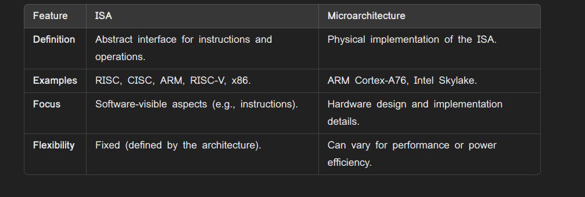
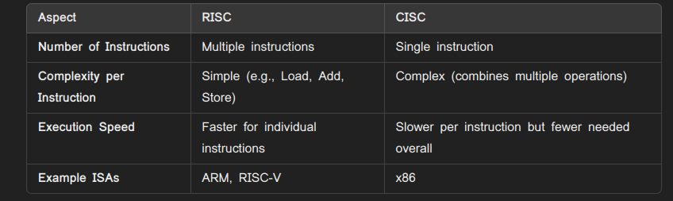
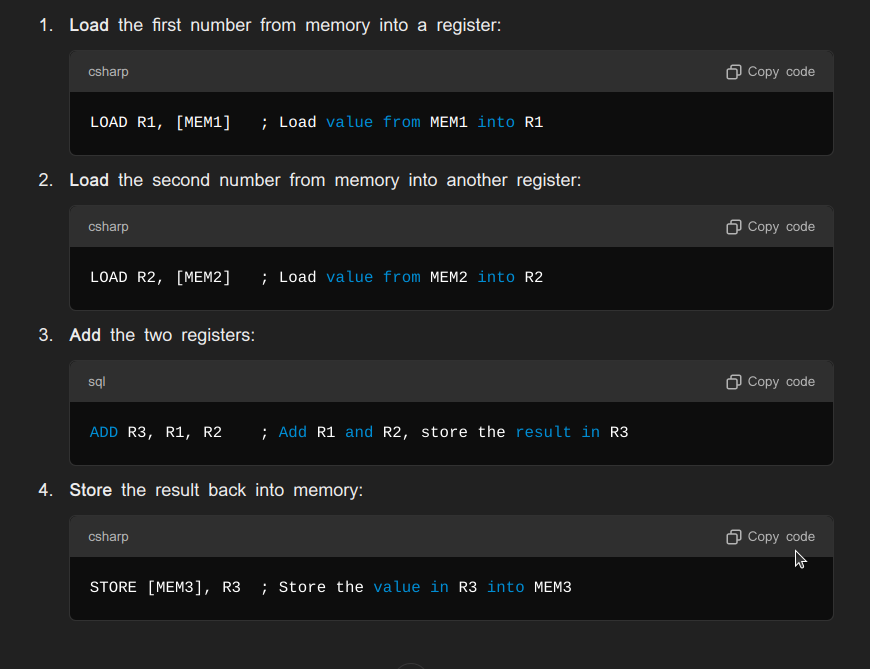

## Resources
* [Ansys](https://www.ansys.com/blog/what-is-system-on-a-chip)
## SoC
* SoC Architecture use ARM processor
* ARM runs small and easy instruction set because it is the family of RISC
* Other company buys design from ARM company
* ARM is a Microarchitecture and RISC is Big A Architecture

* Why RISC is better than CISC ?
    * RISC do operations on registors which efficient than CISC where CISC access from memory which is slower
    * The number of instruction is RISC is higher than the CISC , even though the RISC is efficient because it is designed for the pipelining where multiple instructions are executed simultaneously
    * Even though CISC have less instructions, It requires more clock cycle to decode and execute
    
* RISC Execution

* CISC Execution

