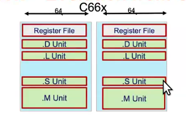
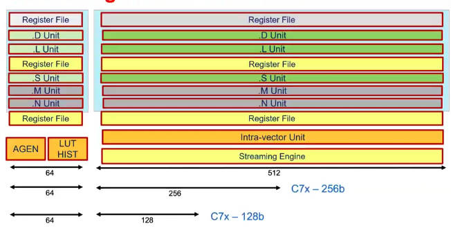
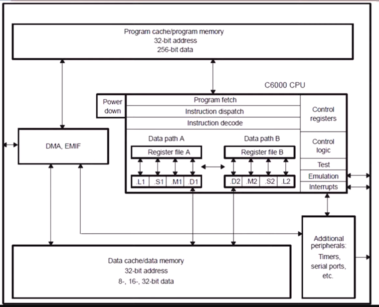

## Resources 
* DSP Architecture : [Click Here](https://www.youtube.com/watch?v=0Y78c9cLdvA&list=LL&index=27)

## Prerequisites
1. Float and Fixed Precision Point : <a href="./floating_and_fixed.md">Click Here</a> 
# C66X DSP
* 32-bit floating point : 
    * one bit is used for the sign, 8 bits for the exponent, and 23 bits for the fraction (mantissa) and it used IEEE754 Standard
    * It is specially designed to handle the mathematical operations need to do some special tasks like compressing and filtering      
    * It is used in complex calculation where we have very high as well as very low values
* Programmable Functional Units :
    * These have different functional units which is specialized in specific tasks
    * L1/L2 - Used for Load/Store operation
    * S1/S2 - For special operations (bit manipulation , address calculation)
    * M1/M2 - USed to do the multiplication operations
        * Audio Signal Processing (e.g., applying a filter to an audio signal),
        * Image Processing (e.g., convolution for edge detection or blurring)
    * D1/D2 - For Division operations and also handle other complex operation (normalizing , transformation)
* Global register files (32x2, 32bit registers) : 
    * It is used to store data temporary during operations inorder to reduce the access time
    * 32x2 - 32 pairs of registers, and each register is 32 bits wide
* Cache-Based Memory System (L1D – 32KB, L1P – 32KB, L2 – 256KB):
    * In most modern processor cache is divided into 2 (data cache holds the data and instruction cache)
    * L1D - Level 1 data cache ,used to store the  the data
    * L1P - Level 1 Program cache ,used to store the  the Instruction(program code)
    * L2 Cache - Used to store both data and Program it is larger than L1
* Dual 64-bit Data Paths:
    * Data path : It is used to carry the data into differennt part of the system(ALU,Memory,Registor)
    * 64 bit data path means , it handle 64 bit of the data in single operation (add,sub,read,write)
    * Dual 64 bit data path means it have 2 independent 64 bit data path which can do their work in parallel , like in a single clock we can do data stream simultaneouly and increase the throughput
* Packed SIMD Operations (8-bit, 16-bit, 32-bit, 64-bit):
* Supports 16bit/32bit complex types
* Supports 128bit vector types (Quad 32bit)
* Supports 32 16bit multiply-accumulate per cycle
* Supports 16 single precision operations per cycle :
    * It contains 16 Floating point operationg in single cycle and used in audio mixing and video decoding
* Supports 40bit operations
* Software pipelining, special SPLOOP HW 
    * SPLOOP HW (Software Pipelining Loop Hardware) is a special hardware feature in the C66x DSP architecture designed to optimize software pipelined loops, which are commonly used in digital signal processing applications.

# C67X Architecture

* In c66x we have 2 side(A and B) , 
* .D Unit: Data Unit (handles data movement and address calculations).
* .L Unit: Logical Unit (performs arithmetic and logical operations).
* .S Unit: Shift Unit (handles bitwise operations and shifting).
* .M Unit: Multiply Unit (performs multiplication operations, essential for DSP applications).
* In C7x we extended our B side from 64 bit into 512 bit and also we doubled the multiplier in both unit
* We moved this into the vector architecture 
* We have a Streaming engine in C7x which directly transfer data from L2 to CPU
* C7x is scalable to smaller devices

## Features 
* The C6000 device execute upto eight 32 bit instructions per cycle
* C67x contains 32 registors(32 bit each) and 8 functional unit (6 ALU and 2 Multiplier)
* The C6000 have a complete set of optimized tools including efficient C compiler an assembly optimizer for simplify code and scheduling and window based debugger
* It contains Advanced VLIW with eight functional units
* It executes 8 instruction per cycle which is 10 times better than the typical DSP processor
* It allows designer to code the high effective RISC code for fast development time
* It have 8/16/32 bit support and provide memory efficent support
* Hardware support for single procision (32 bit) and double precision(64 bit) flaoting point operations
* 32 x 32 interger multiply with 32bit or 64bit result (like when we multiply 2 numbber with 32bit the answer store in both 32 and 64 bit)
* It contains 32 KB instruction cache
* operates 40bit arithmetic operation which gives extra precision
## Block Diagram

* It contains the program memory , which have 32 bit address bus size and 256-bit data bus size
* The we have Data memory which have 32 bit address bus and carry 8/16/32 bit
* In CPU , It contains
    * Program fetch
    * Instruction dispatch
    * Instruction decode
    * Data Path 
        * Data Path A
        * Data Path B
        * There are 16 32-bit register in each register file
        * So that there are 32 32-bit resigter in C67X
        * Data Path A  has
            * L1 , S1 , D1 - ALU units
            * M1 - Multiplier units
        * Data Path B  has
            * L2 , S2 , D2 - ALU units
            * M2 - Multiplier units
    * Control Register
    * Control Unit
    * Test, emulation  and interrupt logic
* IT contains DMA controller which transfer data from external device to internal memory without using the CPU . It contains 4 programmable channel , 5 auxillary channel
