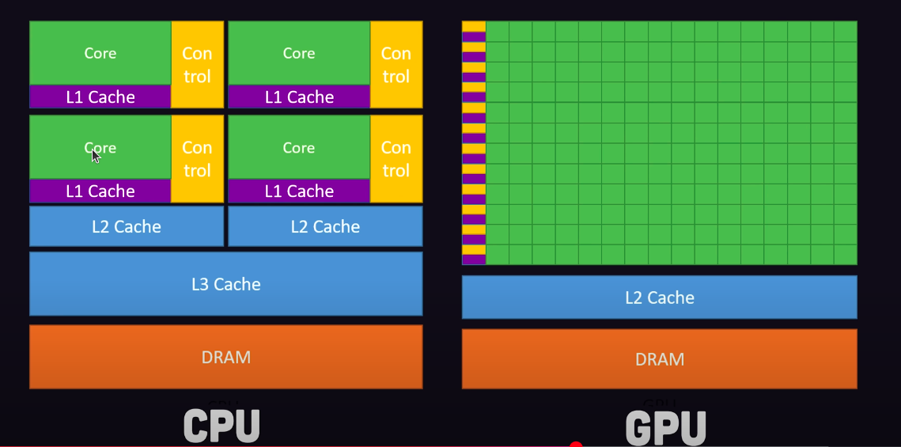
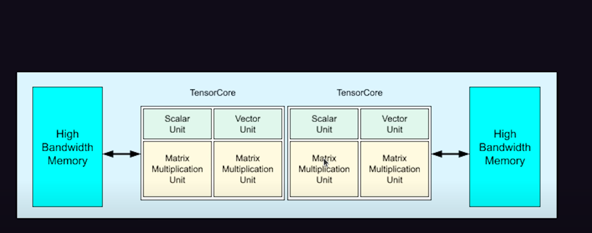
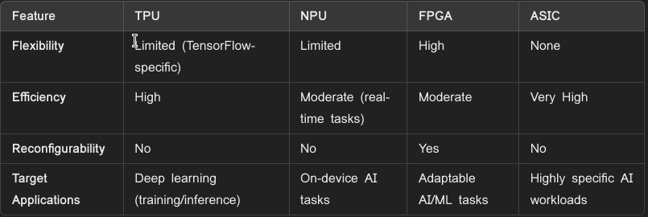

 - 12:40
## Computer Accelerators
* It is a hardware are used to speed up the process in out computer by doing the certain task more efficiently than the CPU . It is used to handle specific operations like handling large amout of data , rendering image or video , doing high complex operation etc
# Types
### CPU (Central Processing Unit) : 
* It is like a human brain , It runs the Operating System , Manage Hardware(CU) and execute program
* It is very well or doing the sequential operation (like if-else) and multiple core us helpful for doing the Parallel process
* It is faster to do the sequential task than any other processor
* A core is like a mini-processor inside the CPU that can independently execute tasks.
* But adding multiple core is not a good option because it is too expensive
* If the core scales up the the power disspication also increase
* Even though with the help of multiple core we can do parallelism but we it is not efficient for some purpose like rendering the video graphics , so that we use GPU
## Graphic Acclerator
### GPU (Graphical Processing Unit)
* It is designed for Parallel Processing which can easily do the operation like rendering image , video and animation
* CPU have 16 core where as GPU have nearly 10000 cores

* It is used to do the linear algebra in parallel to render graphics everytime 
* Useful for training the deep learning model that performs tons of matrix multiplication on large dataset
* So why not we use GPU instead of CPU ? The answer is for simple operation we dont need GPU , ans single CPU core is far faster than single GPU core (GPU rocket , CPU car)
* Example 
    * NVIDIA GeForce RTX 4090 - For 3D rendering and Gaming
    * NVIDIA Tesla V100 - For doing AI and ML tasks
## AI Accelerator
* It is a device used to do the AI and ML tasks which imporves efficiency and reduce latency .
## FPGA (Field Programmable Gate Array)
* These provides flexibility to the designers and it is better than the CPU and GPU because the designer describe the goal circuit in the circuit in Hardware Description Language(HDL) or VHDL
* Is can be reporgrammed after deployment
* It is efficient for real time applications like signal processing and edge AI.
## Application Specific Integrated Circuit (ASIC)
* It is used to do the high workload task efficiently by it is not reprogrammable
* It is cost effective for larger size but manufacturing need more cost
* Used in Cryptographic Mining
* Example
    * Bitmain Adminer : For bitcoin mining
## TPU - Tensor Processing Unit
* Created by Google to do the ML operations (Tensorflow)
* It is like GPU but specifically designed to do the Tensor Operation like matrix multiplication for deep learning
* It has tons of Multiply Accumulator which didn't need any registers to store the  data 
* Application
    * Training deep learning models
    * Google Translate and Google search
* Example : 
    * TPU v4  - Data center for AI workloads
    * Edge TPU : For on Device AI task (smart device - Iot)

## NPU - Neural Processing Unit
* Used to design the AI algorithms mainly in neural netowrk operations
* It is optimized for low power consumption and real time AI processing
* Applications
    * Face Recognization
    * object detection
    * Voice recognization
    * Gooogle Assistant , alexa
    * unlock phone using biometrics
* Example 
    * Apple Neural Engine (ANE): Found in Apple’s A-series and M-series chips for AI tasks like image processing and augmented reality.
    * Qualcomm Hexagon DSP: Integrated into Snapdragon processors for on-device AI.
    * Huawei Kirin NPU: Enables advanced AI in Huawei smartphones.

## Audio Accelerators
### DSP (Digital Sigal Processsor)
* It is a microprocessor designed for reading the real time data like audio , video data  . Apart from this this is also used to enhance the feature in the audio like filtering noise and compressing the audio
* Input audio -> ADC(Analog to Digital Convertor) -> DSP -> enchanced audio -> DAC -> Audio -> Speaker
* application
    * Dolby Atmos use DSP to create 3d audio technology
    * Apple airpods - For noise cancellation
    * spotify use DSP for audio encoding 
* Example
    * TMS320C6713 -  used in audio and signal processing applications.

