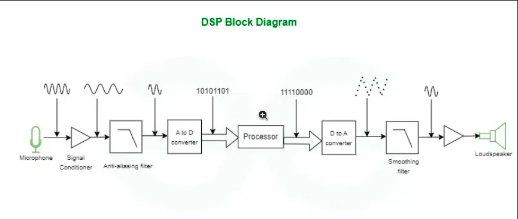

### Resources
* Sampling : [Click Here](https://www.geeksforgeeks.org/sampling-in-digital-communication/)
* Beginner Guide : [Click Here](https://www.analog.com/en/lp/001/beginners-guide-to-dsp.html)
* Quantization : [Click Here](https://www.youtube.com/watch?v=1KBLguIXL30&t=362s)
* Visual : [Click Here](https://www.linkedin.com/advice/3/what-best-ways-analyze-visualize-sensor-data-ghtue#:~:text=2-,1%20Why%20use%20DSP%20for%20sensor%20data%3F,into%20a%20more%20suitable%20format.)

### Common Terms
* Frequency is Reciprocal of Time Period
* Sound : It occurs due to the motion(oscillatory motion or vibratory motion). Sound travel form one place to another place wiht the help of mechanical waves . Like whe we clap our hands , our hand should be in motion and it produces the oscillation which disturbs the air molecule 
* Amplitude : The maximum height above or below the mean or equilibrium position is called Amplitude and the SI unit is meter
* Types of waves : Transverse wave and longitudional wave 
* In transverse wave , Wavelength : Length of successive crest or trough is called Wavelength
* In longitudional wave , Wavelength : Length of successive Compression or rarefaction is called Wavelength
* Wave cycle or 1 oscillation : one crest and one trough
filtering ,compression, modulation , SNR , Quantization error , pitch , Fourier transforms ,Bottlenecks , transducer , CMOS , PMOS
* Time period  : Time taken by the oscillating body to complete 1 wave cycle
* Frequency : Number of wavecycle or number of oscillations complete in 1 second . Like if 3 oscilaltion done in 1 seconds then the frequency is 3 hertz
* Analog Signal :  It is continuous signal , which means it has continuous current and voltage than can very over time
* ADC : Analog to Digital Convertor is used to convert the analog signal into digital signal this is because computer and other digital system can only read digital data . It contains Sampling, quantization, and encoding .
* DSP : It used some algorithm to manipulate and improve the digital signal which is converted by the ADC . It contains Filtering, enhancement, compression
* Transducer : Converts one form of enery into another form of energy
* The Continuous Time Signal is analog signal which reads the analog signal and it is pases through the analog circuit (resistor,capacitor)
* Discrete Time Signal : It is the one which process through Digital circuit
* Combinational Circuit : The output is depends on present input
* Sequential circuit : The output is depends on present input or previous output . It contains memory element so that the output comes from the combinational circuit is stored , and from memory it will pass through the input of the combinational circuit and form the positive feedback
* Periodic Signal : Is is a signal that repeats itself over the period of time (The signal is repeating in the shape) . It is a everlasting signal starts from -inf to +inf
* Aperiodic Signal : There is no repetition of the signal , We can convert it to periodic signal by periodically extending the the aperiodic signal
* Energy Signal : If the signal have finite energy and power is 0 . Sending data bits and it is aperiodic signal
* Power Signal : It is the average of the signal and power is less than inf and energy is inf . It is Periodic Signal . eg : Sinusoidal signals
* In Sound resolution means accuracy (not quality like in image)
### What is DSP
* Digital Signal processing is used to read the digital signal for improving the feature or get essential feature
* It is used in audio processsing , medical processing and control system
* It have the capability to differentiate normal and noise signal and it wont give the perfect result

### Why digital signal is better than Analog Signal
* It produce less affected by noise which uses the discrete signal so that we can easily differentiate the values in noise environment
* Digital Signal have the quantization error which is much typically smaller than the error in analog signal

### Uses of DSP processor
* When we convert analog signal to the digital signale we got some noise error , To correct this we use DSP processor 
* To improve the quality of the signal it contains various techniques like filtering , smoothening .

### Uses of DSP in Audio
* DSP used in music company to impove the music quality and generate new sounds
* Noise reduction is dont by having a noise gate which have some threshold values,it if any of the value os below the threshold then we reject the signal which is noise
* Equalization is used to modify the signal's frequency response to enhance the audio quality
* Compression is used to reduce the audio size which takes less time to transmission
* Pitch correlation usid to produce the particulare sound effect 

### Components of DSP processor
* DSP is a hardward structure because it have seperate memory space for instruction and data and also it need to do some processes in parallel which von neuman can't do
* DSP is a real time signal processing so we have deterministic and low latency we need
* The components are
    * Program Memory : This contains all the program 
    * Data Memory : This contains the data
    * Compute Engine : This is the heart of DSP used to execute the instruction from the Program memory and execute the data from data memory
    * Input/Output : This contains all the outside components

### Digital Signal Processing System

* First it will take the input form transducer device (microphone) and the electriccal signal is send into the op-amp which improve the amplitude of the signal and then pass into the antialiasing filer
* Antialiasing filter used to eliminate the higher frequency by having the threshold rate this is because we want a signal lesser than the half of the sampling frequency
* The filtered signal is passed into the ADC which converts the Analog to Digital Signal and converted into bits 
* By that data we can do the performance and analyse the data through DSP processor anf then it is send to DAC 
* And we use Low pass filter to remove the unwanted higher frequency signal and smootehn the signal
* With the help of Op-Amp that has output transducer ie Speaker

### My doubts
* Why frequency domain is better than the time domain 
* use of op-Amp

## Basics of Digital Signal Processing
### 1. Sampling and Quantization
#### Sampling
* It is the process of converting continuous time anlaog signal into discrete time digital signal
* Sampling Rate : Number of sample per second (in Hz)
* Nyquist rate : The minimum sampling rate will be sample rate = 2 * fmax
* If Sampling Frequency Fs < 2 * fmax The the aliasing occurs which leads to distortion
#### Quantization
* Mapping analog value to limited range of discrete values (discrete points)

| Feature          | Sampling                           | Quantization                       |
|-----------------|----------------------------------|-----------------------------------|
| **Definition**   | Converts a continuous-time signal into a discrete-time signal. | Converts continuous amplitude values into discrete levels. |
| **Domain**       | Time domain operation.            | Amplitude domain operation.       |
| **Result**       | Discrete-time continuous-valued signal. | Discrete-time discrete-valued signal. |
| **Output Type**  | Sequence of samples.               | Digital representation (bits).    |
| **Key Parameter**| Sampling rate ( \( f_s \) ).         | Quantization levels (bit depth).  |
| **Error Type**   | Aliasing error (if under-sampled). | Quantization error (round-off).   |
| **Example**      | Taking temperature readings every hour. | Converting temperature readings to the nearest integer value. |
* My understanding :  In the ADC , the sampling converts the continuous signal into discrete signal (but the amplitude are in continuous) and the it is passed to the quantazation to convert the continuous amplitude into discrete amplitude by using the discrete levels
### 2. Types of Filter
* Low Pass Filter (Hi-Cut) : It allow all the frequencies that is lower than the cutoff frequency and attenuates the signal higher than the cut off frequency
* High Pass Filter (Low-Cut) : It allow all the frequencies that is higher than the cutoff frequency and attenuates the signal higher than the cut off frequency
* BandPass Filter  : It is the combination of Low pass and High pass and allow the signal which have the value of cutoff frequency
* Band Stop Filter  : It is the combination of Low pass and High pass and allow the signal which does not have the value of cutoff frequency

