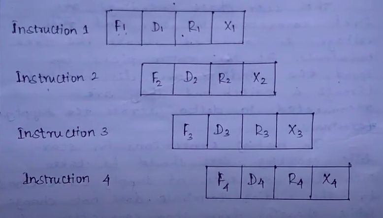

# Resources
* DSP architecture : [Click Here](https://multimed.org/student/zps/en/02-Architecture.pdf)
* Floationg annd Fixed : [Click Here](https://www.rcet.org.in/uploads/files/LectureNotes/ece/S5/DTSP/UNIT%205.pdf)
* TMS320C67x DSP Processor Architecture : [Click Here](https://www.youtube.com/watch?v=0Y78c9cLdvA&t=498s)
## 1. DSP vs GPP
| DSP | GPP |
|-----|-----|
|It contains seperate data and program memory | No seperate memory |
| Instructions are executed in the single cycle of clock | To execute single instruction multiple clock cycle is needed |
| DSP uses modified Harvard Architecture with 2 or 3 memory bases | It based on Von Neuman Architecture |
| Multiple operands are fetched simultaneously | Operands are fetched sequentially |
| They have special mathematical capabilities such as floating point and special function like FIR and IR etc | It have no functions |
| Computational unit present are ALU , MAC and Shifter | ALU |
| Seperate Data and Address buses  for program and data memory (DMA,DMD,PMD,PMA,R-Bus)| Address and Data bus present on the chip |

## Pipelining
* Pipelining is a technique used in CPUs where multiple instructions are overlapped in execution by dividing the processing into stages
* To complete one instrution we need 4 steps
    * Fetch
    * Decode
    * Memory Read
    * Execute
* In old processor the next instruction will happen after the first instruction is over , but now we can optimize this with the help of **Pipelining**

* It imporeves our performance and more efficiency and speed 
* Pipeline works best when each tasks take same amount of time
* My question : What if the current instruction is depends on previous instruction
* Bubbling : A bubble represents a stage in the pipeline that cannot perform any useful work due to the lack of data from an earlier pipeline stage
### 5 Stages of Pipeline
* IF - The instrution is need to be executed in read from the memory using the program counter and Program counter is incremented to the next instruction
* ID - Is is used to decode the instruction in the Control unit 
* Incomplete
### Advantage
* Increased throughput
* Efficient CPU utilization
* Improved performance
### Disadvantage
* Hazard
    * Data Hazard
    * Control Hazard
    * Structure Hazard(Hardware resource are insufficient)
* Complexity
## Superscalar Architecture
* This is the enchancement of pipelining by allowing multiple pipeline occure to improve the performance
### Advantage
* Fast execution
* Automatic Parallelism
### Disadvantage
* Hardware complexity
* High power consumption
## VLIW(Very Long Instruction Word) processor
* It have multiple operation within one bundle (one bundle have multiple operations)
* It is more of a software to decrease the hardware complexity
* Here Multiple instructions are passed as a Word
* It increase the software complexity 
* cannot works on dynamic environment

