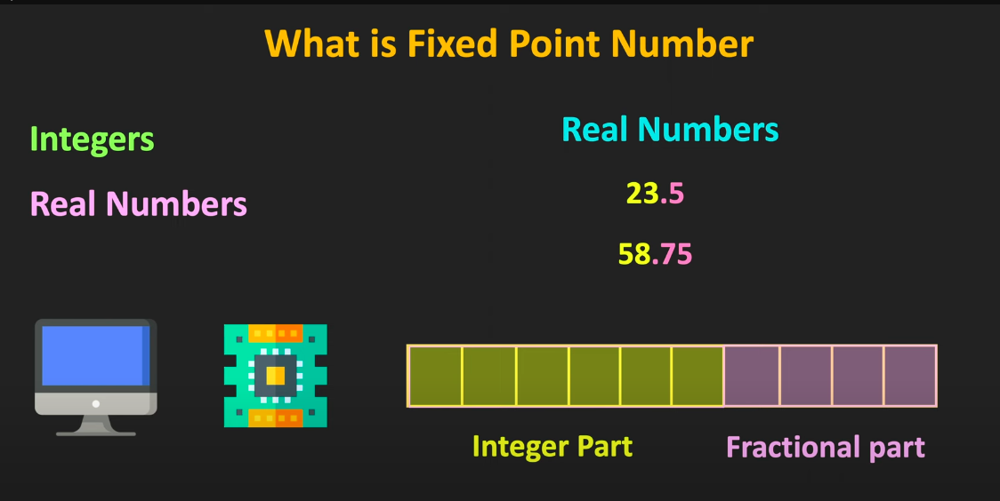
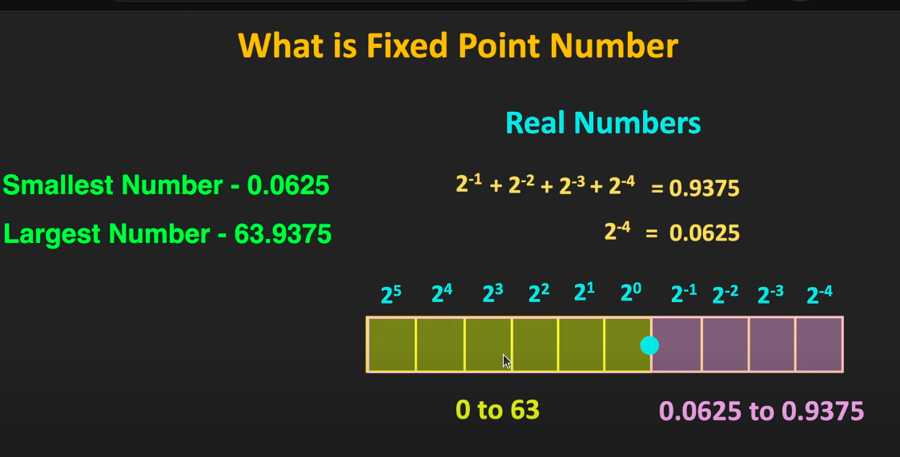
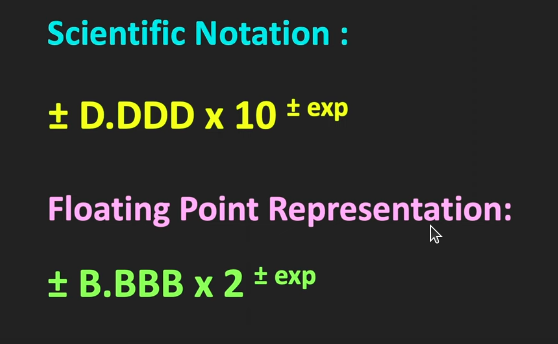
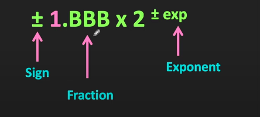
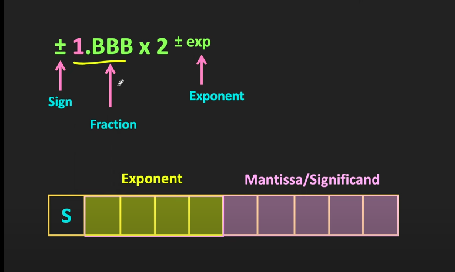

## Floating Point vs Fixed Point
### Fixed  Point : 
* The digit on the left od radix point is integer part and right is fractional part

* Here the position of the radix point or decimal point remains fixed eg.Integer

### Floating Point : 
* The number with very large or very small number can be represented using floating point numbers
* It provides good range and precision
* The reperesentation of the floating point is similar to scientific notation (10234 -> 1.0234 * 10^4) . Like we have only one significant digit before the decimal point and the significant digit before the decimal point should be non zero (0.22*10^2  is not a valid number)
* Significant digit (1.222) also called as mantissa
* 1.3223*10^4 , here 1.3223 is significant digit and 10^4 is exponent digit here we have decima number so that we have the base 10

* In floating point , the only possible significat bit before the binary point is 1

#### Normalization in Floating Point Numbers
* Example : (111.101)2 -> 1.11101x102
* When the radix point / binary point is shifted left by 1 bit position the exponent will be incremented by 1 , and shift by right means decrement by 1 (0.01001)2 -> 1.001x10^-2
#### How floating point is stored

* In Sign bit(S) , 1 means negative value
* The integer part of the significant always be 1 so it wont stored and only store the fractional part 
* See about IEEE754 standard