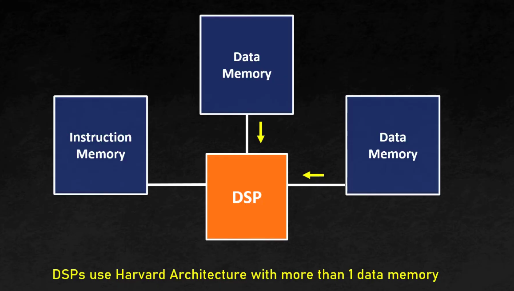

Time : 9 : 30 - 10 : 30 (10/01/2024)
## Van Neuman Architecture
### Components
* CPU
    * ALU
    * Control Unit
    * Registors
* Input Unit
* Output Unit
* Memory
### Why we need this ?
* Most of the computer were fixed program devices which means that they designed to do a single purpose (calculating, Scientific)
* The another was General Purpose Computer designed by Electrical Engineer which the program is more hardware oriented like to run a specific program we need to connect all the respective calculation units (They made by wires and plug boards so there is no instruction , we need to do it manually and it need to be wired correctly)
* So that we have Van Neuman Architecture which is stored program computer , here instead of using wire to do operation (store,add,modify) we simply use **instructions**

## Introduction
* It is also called as stored memory architecture which it contains 2 things , one is data and another is set of instructions(Program)
* Data - a = 10 , b = 20 , c = a + b
* Instructions ADD,SUB,MOV,MBI
* Both of theese are stored in Main Memory , Memory place is allocated for both data and instruction
* The Memory contains both Data and Instruction and it has 3 wire connected to CPU (Address,Data,Control)

* In Non - Neuman Architecture , The data is stored in seperate place

* The registore (sequence of bits) are place in the CPU to get faster access(speed)
* Control Unit have 2 things
    * Clock Signal
    * Control Signal
### Control Unit
* Fetch - It is responsible to fetch the data from the memory , it send Instruction address and COntrol Signal to memory , and the instruction ispassed from memory to CPU through data bus
* Decode - It converts the instruction into Control and Clock signal and pass to other components(ALU,Input,Output)
* It is like out mind which tells what does the other components need to do

* Load(Optional) - Here we send Data address and control signal to the memory and we get the data/operands through data bus , the main feature is both the data and instruction are travelled in the same data bus
* Execute - Control Unit enables ALU for the execution of artihmetic operation (+,-,*,/,AND,OR,NOT)
* Store (Optional) = The result of the ALU is stored in the memory by send the data address from CU to Memory and control signale and the data is travel throught Data bus
* Instruction Cycle : Fetch -> Decode -> Load -> Execute -> Store

### Registors
* Memory accessing can be a time consuming task so that we use Registors to store temporary data which some is used to store the variables temporatily and other is used during Instruction Cycle
* Some types 
    * Program Counter - It contains the address of the next instruction
    * Instruction Registor - It is used to store the courrent instruction
    * ALU
---
* Since it has a single data bus it do the operation in a sequential manner and dont do the parallel process
* Von Neuman Bottleneck = It send either data or instruction
### Von Neuman vs Hardward 

* DSP do repetitive and numerical intensive task So it need seperate memory

